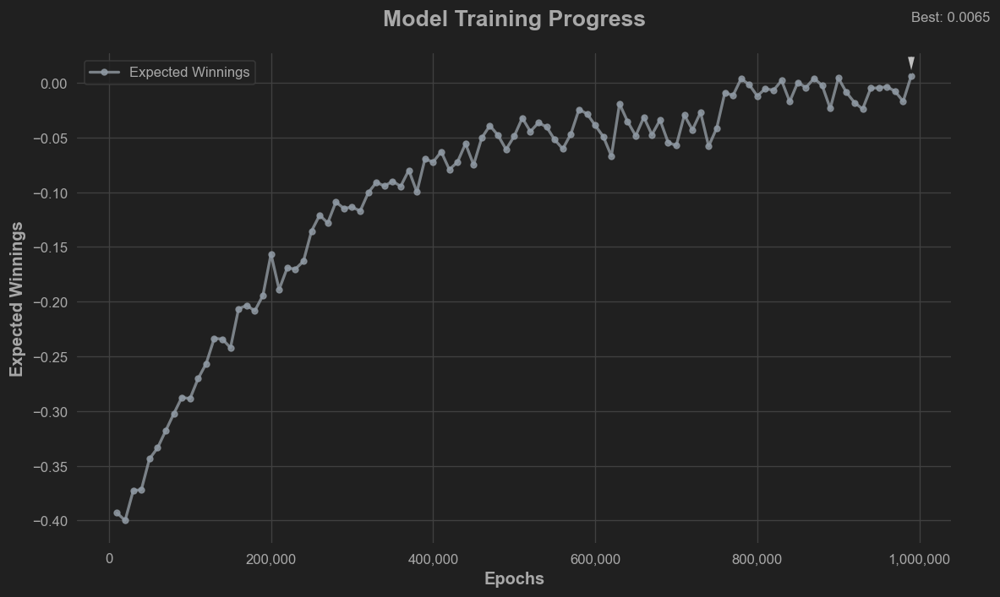
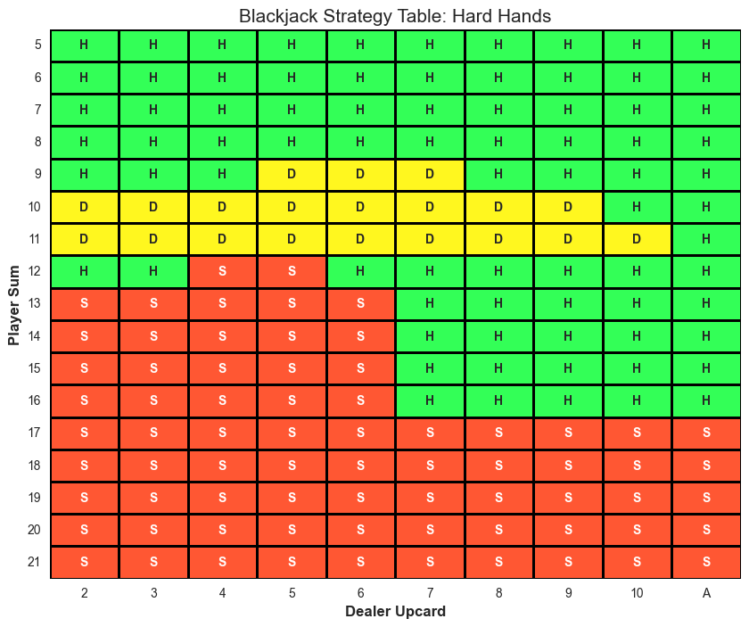
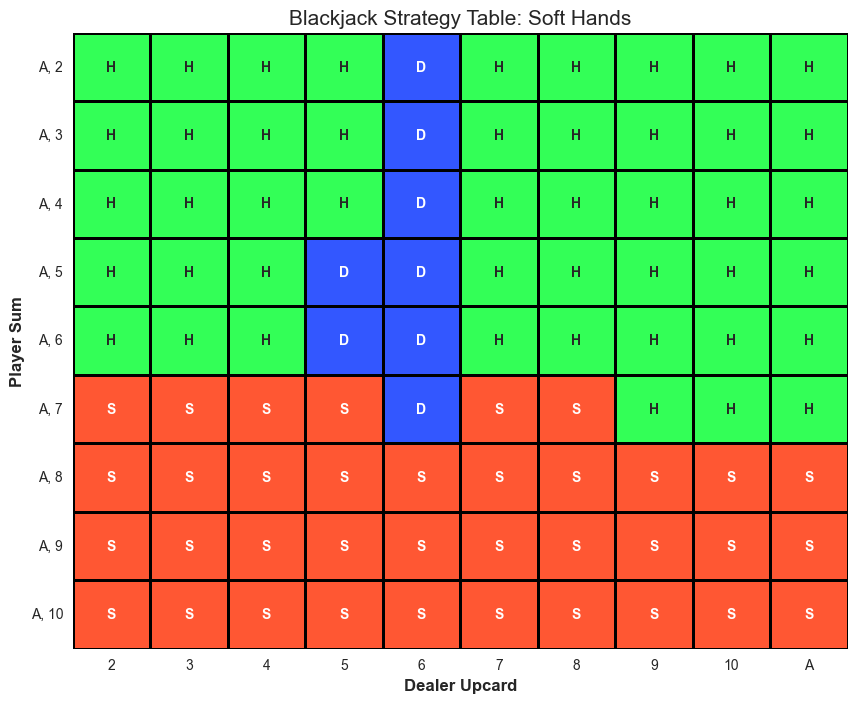
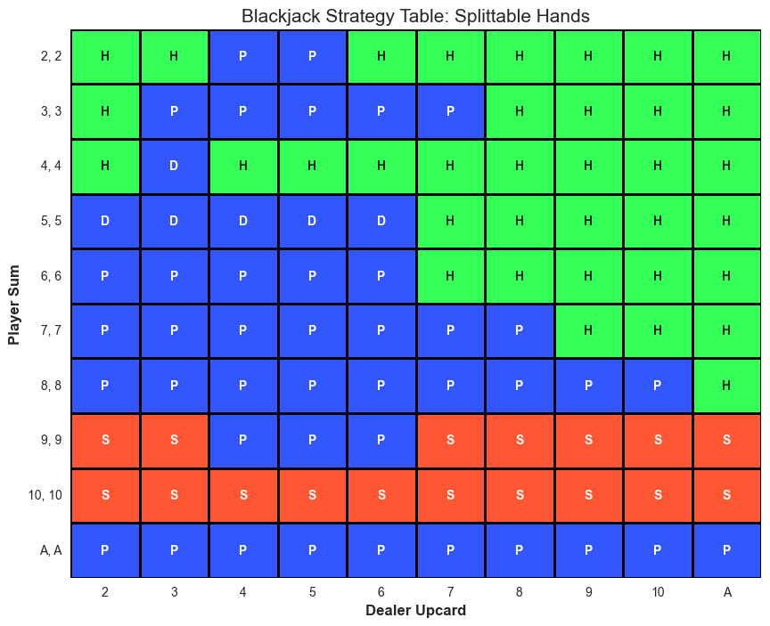

# Blackjack RL Agent

A fullstack Reinforcement Learning project featuring a **Deep Q-Network (DQN)** agent trained to play Blackjack optimally. This project includes a custom-built environment, a high-performance backend, and a web-based UI.

**Website:** [https://blackjack-rl-agent.streamlit.app](https://blackjack-rl-agent.streamlit.app)

---

## **Full Stack**

* **Frontend:** Streamlit
* **Backend:** FastAPI
* **RL Framework:** PyTorch
* **Deployment:** Streamlit Cloud, Render

---

## **Agent & Environment**

* **Custom Environment:** A Gymnasium inspired Blackjack environment with the two additional moves double and split, allowing for specific reward shaping and state representation tailored for DQN training.
* **DQN Agent:** Implements a Deep Q-Network with experience replay and a target network to stabilize training. The agent learns the optimal action by interacting with the custom environment.

---

## **Performance Metrics**

After extensive training, the agent achieves performance levels comparable to professional basic strategy:

* **Winrate:** 43.7%
* **Expected Value (EV):** Approximately 0 (suggesting the agent has effectively minimized the house edge).

---

## **Training & Strategy Visualizations**

### **Training Progress**
The following plot illustrates the convergence of the model and the evolution of the EV over training 3,000,000 hands.

---

### **Learned Strategy Tables**
These tables represent the agent's "brain"—the optimal moves calculated for every possible hand combination. They show that the agent has succesfully learned the most imprtant Blackjack strategies and the tables are nearly identical to statistical calculations.

### Hard Totals

### Soft Totals

### Pairs

